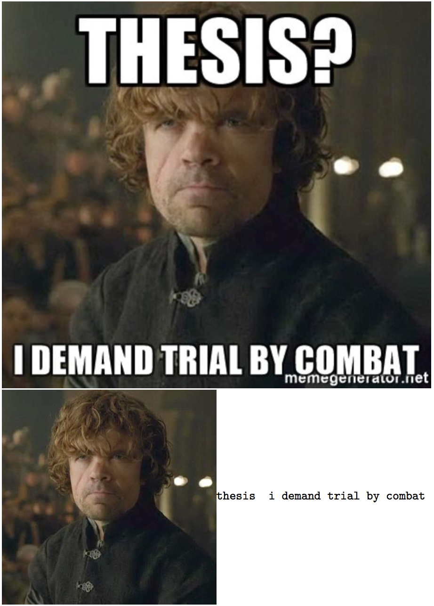
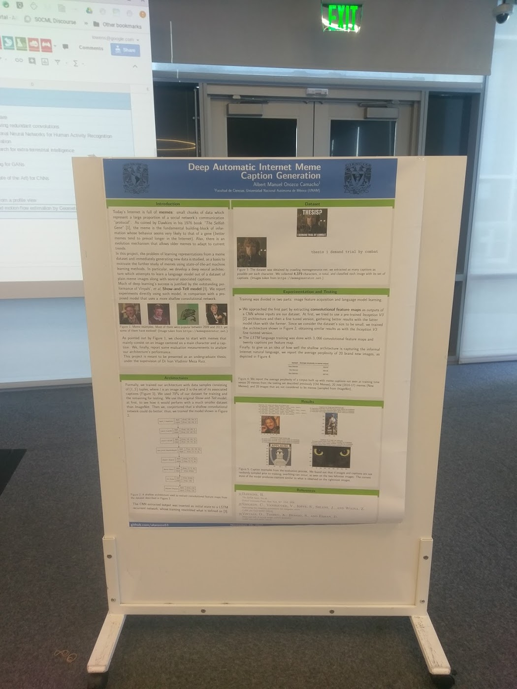

# Deep Learning Meme Captioner

A deep learning model built on Keras (2.0.8) and Tensorflow (1.3.0), and trained to caption meme images!

## Dataset

## Talks and presentations about the process involved doing this project

- https://alorozco53.github.io/talks/eyes_on_bot.html/ (Spanish)
- https://alorozco53.github.io/talks/onto_memes.html (Spanish)
- https://alorozco53.github.io/talks/lessons.html/ (Spanish)
- [Poster](https://drive.google.com/file/d/1DPjqiXcmliwPZBOfBIXxnIX_rs9EPUub/view?usp=sharing) presentation at
  [SOCML 2017](https://twitter.com/search?q=%23socml2017&src=typd).

